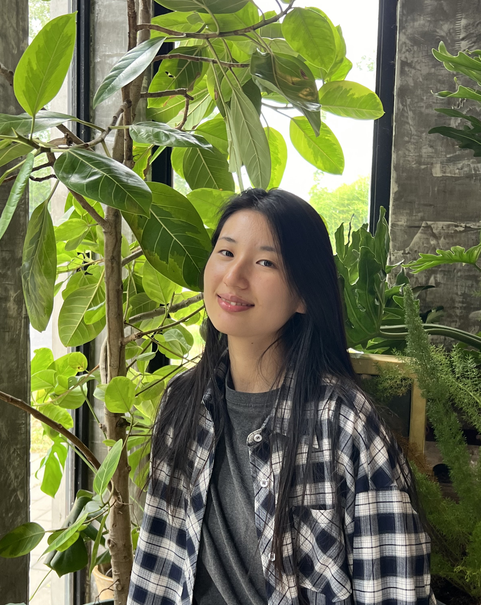

\
{width=30%}
\
\
Hi all!
\

I’m Fangchi Lu, a first-year MS student in Biostatistics at Columbia University. I’m actively exploring statistics and data science within healthcare and beyond, and I’m also enjoying the search for hidden gems around NYC. I'm a total dog person and lucky to have a cute dog named [Mantou](image/mantou1.jpg).

\
\

## **EDUCATION**

**Columbia University** 
&nbsp;&nbsp;&nbsp;&nbsp;&nbsp;&nbsp;&nbsp;&nbsp;&nbsp;&nbsp;
*MS in Biostatistics*
\
\
**The Chinese University of Hong Kong, Shenzhen** &nbsp;&nbsp;&nbsp;&nbsp;&nbsp;&nbsp;&nbsp;&nbsp;&nbsp;&nbsp;
*BS in Statistics*

\

                                                              
## **EXPERIENCE**
**Bairong, Inc.**  
*Data Science Intern, Fraud and Credit Risk*
&nbsp;&nbsp;&nbsp;&nbsp;&nbsp;&nbsp;&nbsp;&nbsp;&nbsp;&nbsp;
May 2024 - Aug 2024\

- Automated an ETL pipeline for 25M+ credit records with data integrity controls and developed a TabTransformer model, boosting fraud detection accuracy by 3%. Enhanced a credit score model with advanced features and ensemble methods, increasing F1-score by 5% and delivering insights for improved client recommendations.

\
\

**Shenzhen Research Institute of Big Data**   
*Healthcare data analyst*
&nbsp;&nbsp;&nbsp;&nbsp;&nbsp;&nbsp;&nbsp;&nbsp;&nbsp;&nbsp;
Nov 2023 - Apr 2024\

- Processed TCGA lung cancer data, applying PCA, t-SNE, and Elastic Net for key gene identification. Conducted Kaplan-Meier survival analysis, revealing significant differences, and used clustering techniques to identify patient subgroups, visualizing findings with t-SNE and UMAP for clinical interpretation.

\
\

**Didi Global Inc.**  
*Data Science Analyst Intern, Customer Insights* 
&nbsp;&nbsp;&nbsp;&nbsp;&nbsp;&nbsp;&nbsp;&nbsp;&nbsp;&nbsp;
Jan 2022 - Mar 2022\ 

- Built an ETL pipeline in Hive SQL to enhance churn detection by 15%, developed predictive models (AUC 0.79) to identify churn drivers, led A/B testing reducing churn by 8%, and created customer segmentation and RFM dashboards, increasing GMV by 5%.

